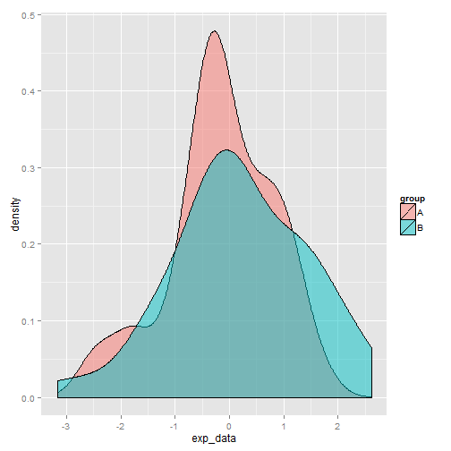
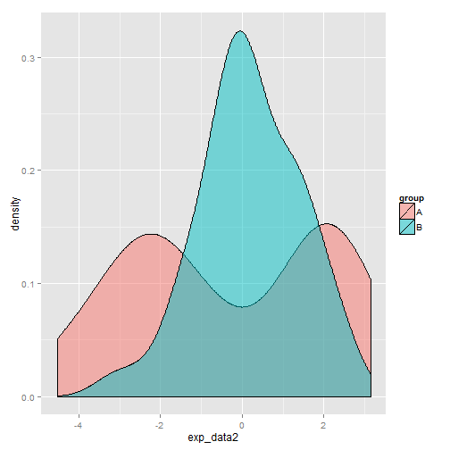

---
# Welcome

Welcome to the **EMDomics** package! This vignette will explain the functionality of the package through the creation and analysis of a toy data set.

# Earth Mover's Distance

**EMDomics** analyzes differences in genomics data between two groups. Typically the data will be gene expression levels from array- or sequence-based experiments, but other scenarios are possible. In a real experiment, the two groups might be test vs. control, sensitive vs. resistant, etc., but here we'll just call them "group A" and "group B". Typically you'll be analyzing differences across multiple genes, but we'll start with a single gene to get a feel for how the Earth Mover's Distance (EMD) algorithm works.

We'll create a vector of expression data for 100 samples, and we'll call the first 50 samples "group A" and the second 50 "group B":


```r
exp_data <- rnorm(100)
names(exp_data) <- paste("sample", 1:100)

groupA <- names(exp_data)[1:50]
groupB <- names(exp_data)[51:100]
```

We'll take a quick look at the two distributions using `ggplot`:


```r
library(ggplot2)
df <- as.data.frame(exp_data)
df$group[1:50] <- "A"
df$group[51:100] <- "B"
ggplot(df, aes(exp_data, fill=group)) + geom_density(alpha=0.5)
```

 

We shouldn't expect the two groups to look too different, since we're just sampling from the normal distribution. Intuitively, the "work" required to transform one distribution into the other should be low. We can calculate the EMD score for this single gene using the function `calculate_emd_gene`:


```r
library(EMDomics)
```

```
## Error: there is no package called 'EMDomics'
```

```r
calculate_emd_gene(exp_data, groupA, groupB)
```

```
## Error: could not find function "calculate_emd_gene"
```

Now we'll modify the expression data for `group A` and see how the EMD score changes. We'll randomly add or subtract 2 from each data point in `group A`:


```r
exp_data2 <- exp_data
mod_vec <- sample(c(2,-2), 50, replace=TRUE)
exp_data2[1:50] <- exp_data2[1:50] + mod_vec
```

Let's again visualize the two distributions and calculate the EMD score:


```r
df <- as.data.frame(exp_data2)
df$group[1:50] <- "A"
df$group[51:100] <- "B"
ggplot(df, aes(exp_data2, fill=group)) + geom_density(alpha=0.5)
```

 

```r
calculate_emd_gene(exp_data2, groupA, groupB)
```

```
## Error: could not find function "calculate_emd_gene"
```

The EMD score is larger, reflecting the increased work needed to transform one distribution into the other.

# Analyzing Significance

The EMD score increases as the two distributions become increasingly dissimilar, but we have no framework for estimating the significance of a particular EMD score. **EMDomics** uses a permutation-based method to calculate a q-value that is interpreted analogously to a p-value. To access the full functionality of the package, we'll use the function `calculate_emd`. 

We'll first create a matrix of gene expression data for 100 samples (tumors, patients, etc.) and 100 genes. We'll just sample from the normal distribution for now. The first 50 samples will be our "group A", and the second 50 will be "group B".


```r
data <- matrix(rnorm(10000), nrow=100, ncol=100)
rownames(data) <- paste("gene", 1:100, sep="")
colnames(data) <- paste("sample", 1:100, sep="")

groupA <- colnames(data)[1:50]
groupB <- colnames(data)[51:100]
```

Now we can call `calculate_emd`. We'll only use 10 permutations for the purposes of this vignette, but in actual experiments using at least 100 permutations is advised.


```r
results <- calculate_emd(data, groupA, groupB, nperm=10)
```

```
## Error: could not find function "calculate_emd"
```

Most of the time, you'll be interested in the `emd` matrix returned as a member of the return object:


```r
emd <- results$emd
```

```
## Error: object 'results' not found
```

```r
head(emd)
```

```
## Error: object 'emd' not found
```

This matrix lists the emd score, the fold change (defined as log2(2^meanA^/2^meanB^)), and the q-value for each gene in the data set. Because we're not analyzing many genes and the data is randomly generated, there will likely be some significant q-values in the results simply by chance. We can order the `emd` matrix by q-value:


```r
emd2 <- emd[(order(emd[,"q-value"])),]
```

```
## Error: object 'emd' not found
```

```r
head(emd2)
```

```
## Error: object 'emd2' not found
```

Note the correlation of significant q-values with relatively large EMD scores and with relatively high fold change. 

q-values of 0 are adjusted to 1/[number of permutations+1]. Keep this in mind
when choosing a value for `nperm` in a call to `calculate_emd`. In general,
the default value of 100 is reasonable.

# Visualization

**EMDomics** includes a few visualization functions. The function `plot_density` will display the density distributions of "group A" and "group B" for a given gene, along with the EMD score. We can compare the gene with the largest EMD score and the gene with the smallest EMD score, for example:


```r
emd3 <- emd[(order(emd[,"emd"])),]
```

```
## Error: object 'emd' not found
```

```r
smallest_gene <- rownames(emd3)[1]
```

```
## Error: object 'emd3' not found
```

```r
biggest_gene <- rownames(emd3)[nrow(emd3)]
```

```
## Error: object 'emd3' not found
```

```r
plot_density(results, smallest_gene)
```

```
## Error: could not find function "plot_density"
```

```r
plot_density(results, biggest_gene)
```

```
## Error: could not find function "plot_density"
```

The smallest EMD score reflects two distributions that are nearly the same overall shape, while the largest EMD score corresponds to distributions that differ significantly.

We can plot a histogram of all the calculated EMD scores with the function `plot_perms`:


```r
plot_perms(results)
```

```
## Error: could not find function "plot_perms"
```

This plot can help intuitively understand the relative significance of an EMD score. For example, almost all the randomly permuted EMD scores are smaller than the largest calculated EMD score plotted above.

In a similar vein, the function `plot_emdnull` plots the null distribution (the median of the permuted EMD scores) for each gene vs. the calculated EMD score (the line x=y is superimposed in red):


```r
plot_emdnull(results)
```

```
## Error: could not find function "plot_emdnull"
```

# Wrapping Up

This concludes the **EMDomics** vignette. For additional information, please consult the reference manual.
